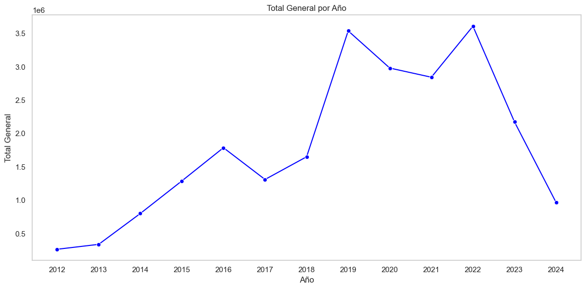
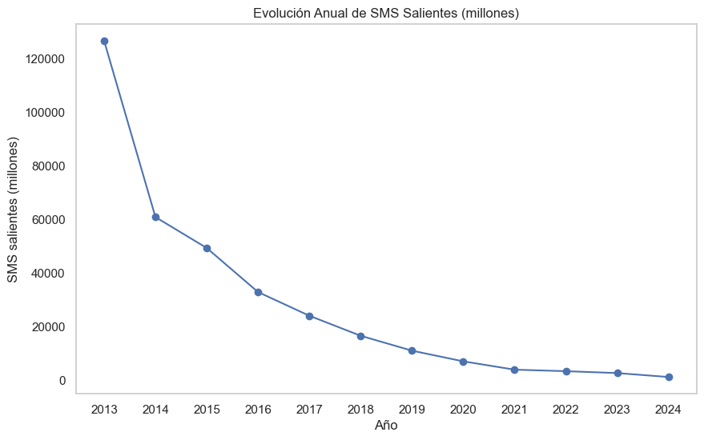
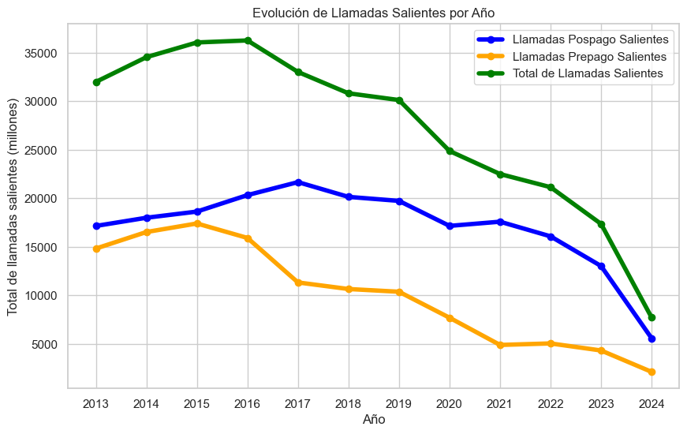
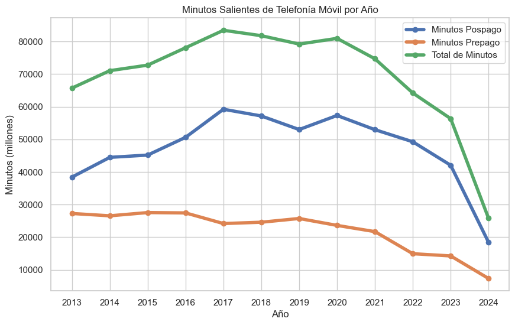

# **Proyecto Individual II - Data Analytics** 
### *Por Alejandro Castellano - DSPT-12*

## **<u>Introducción</u>**
Bienvenidos/as al repositorio de visualización, en esta oportunidad les presentaré el trabajo realizado bajo el rol de  <u>Analista de Datos</u>.  
El trabajo consistió en **analizar datasets** de acceso público, los cuales se refieren a datos de la **industria de las telecomunicaciones en Argentina**, separados por segmentos respecto a *servicios de internet, telefonía celular (o móvil), televisión, telefonía fija* y servicios postales, entre otros.  
En mi caso, utilicé los datasets referidos a Internet, Televisión, Telefonía Móvil y Telefonía Fija. Siendo que, la parte interesada en recibir el Dashboard sería una **firma de telecomunicaciones**.  
Los datasets originales se encuentran disponibles en [ENACOM](https://indicadores.enacom.gob.ar/datos-abiertos).

## <u>**Primer Etapa + EDA</u>**
Una vez descargados, los archivos se encuentran en **formato .xlsx** (más conocido como Excel), por lo que la **carga en Python** fue hoja por hoja, algo que se observará en el archivo correspondiente a EDA.  
Como primer medida, *se analizaron las estructuras y el recuento obligatorio de faltantes, nulos y duplicados*. Hay comentarios sobre cada caso distinto del general, donde se marcan las <u>decisiones tomadas</u>.  

### <u>**Internet</u>**
Luego de hacer un primer recorrido por el dataset principal referido a Internet, **se normalizaron los dataframes** respecto a sus variables de texto para tender a homogeneizar campos, siempre pensando en que luego habrá que relacionar todo en un **DER (Diagrama Entidad Relación)**, que deberá ser iterativo y por lo tanto si ya desde el principio utilizamos ese enfoque, se facilitará el trabajo posterior.  
Se utilizaron gráficos para explicar los motivos por los cuales podrían ser de utilidad los distintos dataframes, así como se brindaron explicaciones de los motivos por los que no se utilizarían otros (ej:falta de series temporales, inconsistencia de datos numéricos, etc).

## <u>**Gráfico de Demanda de Velocidad por Provincia</u>**
  
Se concluyó que la **demanda de velocidad** tiene *tendencia alcista* en la mayoría de las provincias, por lo que se consideraría oportuno presentar este tipo de información para un interesado en el sector.  

Continuando el análisis de internet, encontramos que había **diferentes tecnologías de prestación de servicios**, por lo que se dio forma a un *gráfico de correlación* para identificar posibles relaciones entre tecnologías y/o el paso del tiempo.

  
Observamos que el paso de los **años tiene una correlación directa positiva con Wireless (inalámbrico), Fibra Óptica y Cablemodem** en ese orden y que hay una **correlación inversa negativa con ADSL**.  
Dejando en claro que esta última tecnología tiende a desaparecer, volviéndose obsoleta para los planes futuros. <u>La empresa debería concentrarse en las tres mencionadas con correlación positiva</u>.

  
Para simplificar, se muestra las correlaciones de los distintos tramos de velocidad evaluados respecto al paso de los años.  
Las correlaciones negativas indicadas en colores fríos (azul,celeste) indican que sus demandas caen a medida que avanzan los años.  
En el otro caso, las positivas con colores cálidos (rojo,rosado), nos dicen que esas velocidades aumentan sus demandas conforme pasan los años.

  
Para finalizar el análisis de Internet, exponemos el **crecimiento (nominal en pesos) del mercado** en los últimos 10 años.

### <u>**Telefonía Fija</u>**
El dataset de 5 hojas nos permitió ahondar en el análisis de múltiples variables, como a continuación mostraremos, la **evolución de la demanda** a lo largo de los años, *por provincia y segmento de consumidores*.
  
Se observa que la *demanda de servicios de telefonía fija ha disminuido*, pero, el dato sobresaliente, que se reflejará de mejor forma en el Dashboard, es que el **consumo de las familias** sigue representando cerca del 90% de la demanda, podría inferirse que las familias son el segmento más importante de la demanda, esto sirve para saber a dónde apuntar la oferta.

Para finalizar el segmento, se mostrará que **los ingresos**, al igual que con Interner, **han aumentado (en pesos nominales)** a lo largo de los últimos años.

### <u>**Telefonía Móvil</u>**

Analizamos portabilidad y nos demostró que **las personas están menos interesadas en cambiar de compañía proveedora de telefonía celular**.

Del mismo modo, tanto los mensajes de texto (SMS), como las llamadas y los minutos, han experimentado bajas en los últimos 10 años. Esto podría deberse a la **irrupción de nuevas tecnologías de comunicación** como Whatsapp, Telegram y las distintas redes sociales que permiten las comunicaciones a través de los servicios de internet de los distintos paquetes que ofrecen los proveedores. Vemos a continuación gráficos de lo mencionado.

Del mismo modo que los servicios analizados anteriormente, **el volumen de mercado (market share) que alcanza este tipo de servicios, se ha incrementado en la última década analizada**, cabe considerar que la moneda corriente (nominal en pesos), ayuda a que el mismo sea abultado.

Antes de cerrar este segmento, se hará mención al dato de accesos promedio cada 100 habitantes, el cual nos permitirá conocer como ha fluctuado la demanda respecto a la cantidad de habitantes, si consideramos que la población se ha incrementado (Censo 2010 - cerca de 40 millones de habitantes, censo 2022 - cerca de 45 millones de habitantes), podría derivarse que en definitiva el mantener un comportamiento lateral sería un indicador positivo.

### <u>**Televisión</u>**
El último segmento analizado, consideré que podría ser de interés para el potencial dueño de la empresa de telecomunicaciones, en caso de que su **empresa pudiera integrarse** de alguna forma y expandir su horizonte hacia una *industria que, aún envejecida, mantiene su competitividad y rentabilidad*.
El análisis comienza con la **demanda de sucripciones por provincia**, el gráfico a continuación (no es el más estético), muestra que **la mayoría de las provincias no ha disminuido su nivel** de demanda, hay casos de incremento como Tierra del Fuego, Santa Fe y Buenos Aires, y casos de disminución como Neuquen y Santa Cruz.
En Catamarca puede que haya un outlier dentro del año 2018.

Como siguiente punto, se analizaron los dos principales métodos de provisión de servicios de televisión, sea **satelital o por suscripción**. El gráfico a continuación es determinante en cuanto a que **el servicio por suscripción mantiene su atractivo**, mientras que el servicio satelital está entrando en una debacle importante.

Como punto fuerte, debemos resaltar, al igual que todos los segmentos de negocio analizados, que **el market share se ha incrementado**, aún en ambos segmentos. Por lo tanto, si ha caído la demanda, pero los ingresos se han incrementado, esto nos indica que **el incremento de los ingresos debido al aumento de los precios es más que proporcional al decremento de la demanda (de servicios satelitales**). <u>**Es un concepto económico llamado Elasticidad Precio de la Demanda.</u>**

Con esto doy por finalizado la etapa EDA. Espero no haberme extendido de más.

## <u>**Segunda Etapa - MySQL</u>**
Se realizó la *cración de una base de datos* **(telecomunicaciones)** como parte de una sugerencia, en la cual se cargaron los 22 datasets definitivos para luego ser importados a Power BI.
En el repositorio se encontrará una carpeta llamada **"database"**, en la que habrá un **archivo .SQL** para ser desplegado directamente y que genere la base de datos correspondiente.
A su vez, se incluyó un **archivo .PDF** en el que se relatan los pasos realizados para la conexión de la base de datos con Power BI para su visualización.

## <u>**Etapa Final - Dashboard </u>**
El Dashboard se elaboró de acuerdo a los *potenciales intereses de una empresa de telecomunicaciones*, con foco principal en los servicios de internet y de forma accesoria se desarrollaron páginas dedicadas a cada segmento complementario, sea para Telefonía Móvil, Televisión y Teléfono Fijo.
Entonces se detalla a continuación una guia orientativa de lo que se verá en el Dashboard.
Se menciona que se desarrollaron 4 filtros:  
- **Rango de Años**, permite seleccionar el período de análisis. (Ej:2020-2023).  
- **Selección de Año**, puntualiza en solo un año del período antes seleccionado.  
- **Provincia**, hay información que se está segmentada por esta variable.(Se pueden seleccionar una, varias y/o todas).  
- **Trimestre**, permite la selección individual o conjunta de los períodos. Se sugiere su combinación minuciosa para obtener información de valor.  

### <u>**Internet (3 páginas):</u>**
- **Velocidad de Bajada Promedio** --> Permite observar la evolución de la velocidad promedio demandada en Mbps. Se observa un crecimiento ininterrumpido a lo largo de los últimos 10 años.

- **Evolución Tecnología Utilizada** --> Se utiliza para conocer el avance de qué tecnologías priman para la prestación de internet, contundente desaparición de ADSL e irrupción de Fibra Óptica.

- **Distribución Tecnología (Provincias)** --> Permite complementar el gráfico anterior, siendo un gráfico circular de proporciones.

#### <u>**Demanda:</u>**
- **Evolución Demanda según Velocidad** --> Gráfico de columnas que permite determinar que tramos de velocidades han sido y son los más demandados por los usuarios.

- **Distribución Demanda según Velocidad** --> Gráfico de torta que complementa el análisis anterior, permitiendo conocer la proporción de cada segmento a fin de determinar el 

- **Evolución Demanda (usuarios)** -->  Refleja la evolución de los accesos de usuarios al servicio. Crecimiento continuo a lo largo de la década.

- **KPI** -->  En el rincón superior derecho se indicó un medidor con un objetivo de 70% para el tramo de velocidades +30Mbps, indicará que se ha cumplido el objetivo cuando la cantidad de accesos demandados de dicho tramo sea superior al objetivo. Focaliza cual será el tramo de velocidades predominante para el potencial ofrecimiento de un servicio.

#### <u>**Mercado</u>** 

- **Evolución Ingresos** --> Gráfico de columnas para conocer el avance del mercado respecto a su market share (volumén de dinero), un mercado con market share en crecimiento será más deseable que uno en decrecimiento. En este caso el gráfico muestra un crecimiento (en pesos nominales) de los ingresos para el sector de prestación de servicios de internet.

- **Tarjeta** --> Se menciona el objetivo de incremento establecido para los accesos por trimestre (según hoja de trabajo propuesta 2%).

- **5 Provincias con Más Accesos** --> En principio había dos gráficos de este estilo, con 10 provincias. Uno con las provincias de accesos y otro con las de menos accesos para que el decisor pudiera observar los mercados potenciales en cada provincia. Si hay más accesos, habrá mayor demanda y mayor competencia; en cambio, si hay menor acceso, habrá menor competencia y mayor posibilidad de desarrollar mercado (penetración).

- **KPI** : Funcionan en conjunto, con filtros activados en Año específico, Provincias específica y Seleccionando un Trimestre.
            + **Medidor** : Muestra el valor del acceso actual, y el objetivo del valor del nuevo acceso (lo que debería alcanzarse en el próximo trimestre, +2%)
            + **Indicador** : Muestra el valor del próximo trimestre con el valor objetivo establecido en el medidor, en color verde si se cumple o en rojo si no se cumple.
(Lamentablemente hay un error que hace que solo funcione cuando se filtran los trimestres 1 y 4. No pude encontrar el motivo y el tiempo se agotó).

### <u>**Telefonía</u>** 

- **KPI** --> Indicador en la esquina superior derecha que nos cuenta el crecimiento de los ingresos del sector respecto al año anterior, utilizando como objetivo de referencia un 50% (arbitrario).

- **Evolución Llamadas** --> 3 indicadores de características de la antigua provisión de servicios de telefonía móvil, importante destacar que la demanda ha cambiado respecto a los servicios.

- **Portabilidades** --> 3 indicadores de características de la antigua provisión de servicios de telefonía móvil, importante destacar que la demanda ha cambiado respecto a los servicios.

- **SMS Enviados** --> 3 indicadores de características de la antigua provisión de servicios de telefonía móvil, importante destacar que la demanda ha cambiado respecto a los servicios.

- **Promedio Accesos** --> Se decidió exponer como ha fluctuado el uso de telefonía móvil por cantidad de habitantes, siendo que el número de habitantes se ha incrementado en los últimos años, el promedio de accesos se mantuvo consistente alrededor de 150 x cada 100 habitantes. Es un indicador de que el negocio es demandado

- **Ingresos** --> Es importante considerar el volumen de negocio del segmento, por lo que se decidió graficar la evolución de los ingresos (en pesos nominales).

### <u>**TV</u>**  

- **KPI** --> El indicador en verde muestra el promedio de ingresos mensuales por suscripción. Debería establecerse un objetivo para compararlo.

- **Tarjeta** --> La tarjeta azul muestra la cantidad de accesos cada 100 hogares.

- **Tarjeta** --> La tarjeta morada muestra la cantidad de accesos cada 100 habitantes.

- **Accesos Promedio c/100 Habitantes** --> La página toma como premisa la distinción entre dos tipos de servicios de televisión, por lo que se decidió demostrar el comportamiento por separado de el servicio de televisión **Satelital** del de **Suscripción**. En este gráfico observamos que la suscripción promedio se mantiene, mientras que la contratación satelital disminuye.

- **Accesos Promedio c/100 Hogares** --> Al igual que el gráfico anterior, el comportamiento también se refleja en los hogares.

- **Distribución** --> Gráfico de proporciones para identificar como se distribuye el mercado de la televisión entre sus servicios. Predomina la suscripción.

- **Ingresos** --> Segregada por tipo de servicio, al igual que los otros servicios analizados, se observa un crecimiento del market share  (en pesos nominales), lo que podría ser un indicador positivo de acuerdo a los intereses de los inversores.

- **Suscripciones Anuales** --> Como gráfico final, se decide elaborar y puntualizar en el segmento de demanda que domina el mercado y como su crecimiento consistente podría indicar que el mercado seguirá siendo rentable en el corto plazo.

### <u>**Teléfono Fijo</u>** 

- **Tarjeta** --> Promedio de Accesos c/100 Hogares

- **KPI** --> Proporción del total de demanda que son familias.

- **Promedio Accesos** --> Se gráfica cada 100 hogares y cada 100 habitantes, una clara merma de la demanda de este servicio, lo que indica un menor deseo o necesidad de contar con teléfono fijo.

- **Ingresos** --> A pesar de la reducción de accesos, los ingresos del sector se han mantenido en constante crecimiento a lo largo de los años (en pesos nominales), lo que podría indicar que hay un mercado activo en el que se podría obtener ganancia.

- **Evolución y Distribución de la Demanda** --> Para finalizar, un gráfico de columnas apiladas que muestra la evolución (decrecimiento) de la demanda y su composición, dejando en claro que las familias son los principales consumidores de este servicio y las empresas en segundo lugar. la tendencia parece haber encontrado cierta calma luego de un bajón importante entre 2018 y 2020 (quizá la pandemia tuvo algún efecto).

** Considerar que en todos los casos, el año 2024 está por la mitad, por lo que su análisis debe ser cauteloso al momento de comparar con otros años.**

## <u>**Conclusiones</u>**
Se analizaron muchos datasets, se encontraron anomalias, datos inútiles y redundancia. Se intentó purgar lo irrelevante y generar un análisis lo más limpio, conciso y razonable posible dentro de los conocimientos y las limitaciones inherentes a la tarea.
Considero que la información desplegada es suficiente para tomar una decisión respecto a que tipo de servicio, consumidores y ubicaciones deberían llevarse a cabo en la empresa.
En el cierre del dashboard se encuentran las conclusiones referidas a la información analizada.
Quedaré atento a propuestas de mejoras, hay errores y siempre se puede mejorar.

## <u>**Agradecimientos</u>**
A Henry por la posibilidad y a todo/a aquel/la interesado/a en el repositorio.  
**Muchas Gracias**